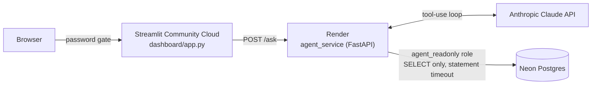

# NBA SQL + Agentic Analytics Platform

A full-stack NBA analytics platform: an 80-season historical data pipeline (1946-47
through 2025-26) sitting behind an **agentic RAG** service built directly on the Claude
API — no LangChain, no agent framework — with a live Streamlit dashboard on top. Instead
of retrieving from a vector store, the agent retrieves by autonomously writing and
running SQL against a live Postgres database, grounding every answer in real rows it
just queried rather than the model's own recall.

**Live demo:** https://nba-database-overlay.streamlit.app

## Highlights

- **Agentic RAG over structured data, not a single vector lookup.** Most RAG retrieves
  static text chunks once and stuffs them in the prompt; here retrieval is a live,
  multi-step decision the model itself drives: it calls `get_schema` to see what's
  queryable, writes SQL, calls `run_query`, reads the real result (or a real error) and
  self-corrects, looping until it has actual retrieved rows to ground the answer in —
  with the exact SQL it ran always surfaced alongside the answer, so every answer is
  independently verifiable rather than a black box.
- **Hand-rolled tool-use loop, not a framework.** `agent_service/agent.py` drives the
  Claude Messages API directly (no LangChain/LlamaIndex) — the whole retrieval loop
  above is under 90 lines of explicit tool-dispatch code, not framework abstraction.
- **Defense in depth for LLM-generated SQL**, three independent layers rather than one:
  1. A dedicated `agent_readonly` Postgres role, `SELECT`-only at the database level
     with an enforced statement timeout — enforced by Postgres itself, not application code.
  2. Structural validation via `sqlglot` (`agent_service/sql_guard.py`): the generated
     SQL is parsed into an AST and rejected outright if it isn't a single `SELECT`
     statement — a keyword blacklist can be fooled, an AST check on statement type can't.
  3. An automatically enforced row limit injected into the parsed query.
- **80 seasons of reconciled NBA history** (30 teams, 6,694 players, 73,266 games,
  1.5M player-game box scores, 16.5M play-by-play events locally), built from multiple
  overlapping, imperfect public datasets — including catching and fixing a real silent
  gap (the entire 2012-13 play-by-play season was missing from an otherwise "complete"
  source, found via a systematic per-season coverage audit, not assumed).
- **Real production deployment, not just `localhost`:** three independently hosted
  services that only ever hold the credentials they strictly need — Streamlit Community
  Cloud (UI, zero DB credentials) → Render (agent API, only a read-only DB role) → Neon
  (serverless Postgres). See `render.yaml` for the deploy config.
- **Honest under real hosting constraints.** The free-tier hosted database omits the
  3GB `play_by_play` table; rather than erroring or silently returning wrong answers,
  both the agent's own schema description and the dashboard UI explicitly tell the user
  play-by-play isn't available in this deployment, driven by one shared setting.
- **Cost-conscious public deployment:** password-gated dashboard plus a hard spending
  limit on the API key, because an open text-to-SQL agent behind a public URL is an
  open tab.

## Architecture



The dashboard never touches the database directly — every question goes through the
agent service over HTTP, so the only thing capable of running SQL is the one process
running it through both the `sqlglot` guard and the restricted DB role.

## Data pipeline

- **Bootstrap ETL** (`ingestion/bootstrap/`): loads teams/players/seasons/games/box
  scores from Kaggle historical exports (wyattowalsh's dataset plus eoinamoore's
  box-score dataset for gap-filling), reconciled into one consistent schema via Alembic
  migrations, including a `player_season_stats` materialized view for season-level
  aggregates computed correctly (season-long `SUM(made)/SUM(attempted)` shooting
  percentages, not an average of per-game percentages).
- **Play-by-play** loaded from two non-overlapping sources spanning 1996-97 onward,
  with documented per-era quirks (inconsistent event-type vocabulary, shot-location data
  only populated from 2023 onward) baked directly into the schema description the agent
  reads — domain knowledge that shapes the model's queries, not just human-readable docs.
- **Ongoing sync** (`ingestion/sync/`): an `nba_api`-based pipeline for keeping data
  current after the historical bootstrap.

## Repo layout

| Path | What it is |
|---|---|
| `db/` | SQLAlchemy models, settings (`pydantic-settings`), engine/session |
| `alembic/` | Schema migrations, including the `agent_readonly` role/grants |
| `ingestion/` | Bootstrap ETL + ongoing `nba_api` sync |
| `agent_service/` | FastAPI text-to-SQL agent (Claude tool-use loop, SQL guard, schema) |
| `dashboard/` | Streamlit UI — single agent-chat page, password-gated |
| `tests/` | Unit tests for ETL cleaning logic and the agent's SQL safety layer |

## Running locally

```bash
docker compose up -d          # local Postgres
pip install -r requirements.txt
alembic upgrade head          # schema + agent_readonly role
python -m ingestion.bootstrap.run_bootstrap main
uvicorn agent_service.main:app --reload --port 8000   # in one terminal
streamlit run dashboard/app.py                        # in another
```

See `agent_service/README.md` and `dashboard/README.md` for environment variables and
deploy-specific notes.

## Testing

```bash
pytest
```

59 tests covering ETL cleaning/reconciliation logic and the SQL safety layer
(`sql_guard.py`) — multi-statement rejection, non-`SELECT` rejection, row-limit
injection — with no live DB or API dependency, so they run in milliseconds.
